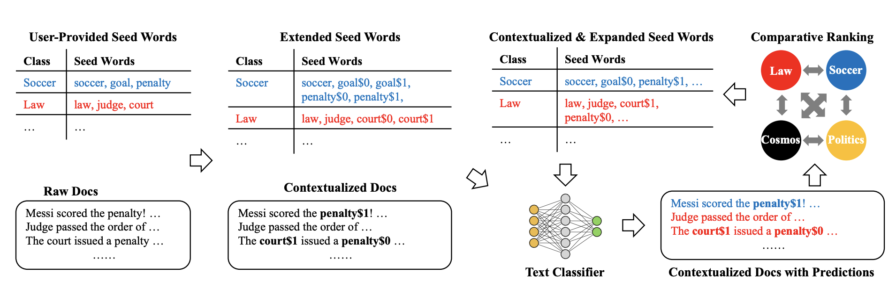

# ConWea: Contextualized Weak Supervision for Text Classification

- [Model](#model)
- [Training](#training)
	- [Required Inputs](#required-inputs)
	- [Commands](#commands)
	- [Requirements](#requirements)


## Model



## Training

Dataset: https://github.com/dheeraj7596/ConWea/tree/master/data

### Requirements
 to install requirements of this code:hgfds
  - pip install -r requirements.txt

### Required inputs
Each Dataset should contain following files:
- **DataFrame pickle file**
  - Example: ```data/nyt/coarse/df.pkl```
    - This dataset should contain two columns named ```sentence```, ```label```
    - ```sentence``` contains text and ```label``` contains its corresponding label.
    - Must be named as ```df.pkl```
- **Seed Words Json file**
  - Example: ```data/nyt/coarse/seedwords.json```
    - This json file contains seed words list for each label.
    - Must be named as ```seedwords.json```

### Commands


#### Corpus Contextualization: 
The ```contextualize.py``` requires three arguments: ```dataset_path```, which is a path to dataset containing 
required DataFrame and seedwords, ```temp_dir``` is a path to a temporary
directory which is used for dumping intermediate files during contextualizing the corpus, and ```gpu_id``` refers to the 
id of the gpu. If not mentioned, the process runs on cpu.
To contextualize the corpus, please run:
```shell script
$ python contextualize.py --dataset_path dataset_path --temp_dir temp_dir_path --gpu_id 3
```

The ```tests/test_contextualize.py``` is a unittest to check the sanity of contextualization. To run this unittest, please execute:
```shell script
$ python -m unittest tests/test_contextualize.py
``` 
 
#### ConWea - Iterative Framework:
The ```train.py``` requires two arguments: ```dataset_path```, which is a path to dataset containing 
required contextualized corpus DataFrame dumped by ```contextualize.py``` and seed words, and ```gpu_id``` refers to the 
id of the gpu. If not mentioned, 
the process runs on cpu.
To train ConWea, please run:
```shell script
$ python train.py --dataset_path dataset_path --gpu_id 3
```

The ```tests/test_conwea.py``` is a unittest to check the sanity of framework. To run this unittest, please execute:
```shell script
$ python -m unittest tests/test_conwea.py
``` 

